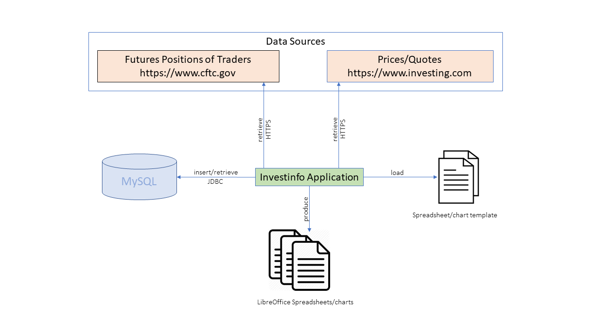
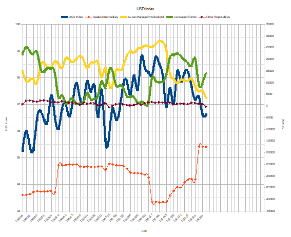
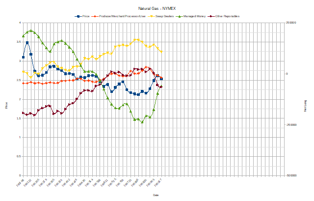

# InvestInfo
This Java application helps professional Forex/Commodity traders to track and analyze the trend of Forex/Commodity Futures products.

It does so by linking the weekly close prices/indices of CFDs (currenly from www.investing.com) with the position data for Tuesday, which is released every Friday by
Commodity Futures Trading Commission (CFTC) (www.cftc.gov).

# Architecture

# Build
Import Maven project into Eclipse
Import User Libraries
mvn package

# How to run InvestInfo application?
See the usage [here](HELP.md)

# Samples Charts
US Dollar Index

Natural Gas Futures

